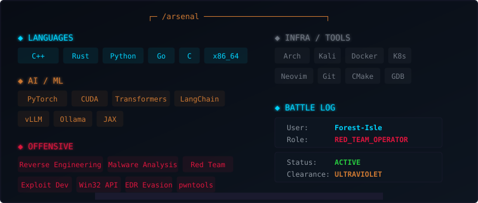

<picture>
  <source media="(prefers-color-scheme: dark)" srcset="assets/header-dark.svg">
  <source media="(prefers-color-scheme: light)" srcset="assets/header-light.svg">
  
</picture>

 

> ***Deep in the stack. Between CUDA kernels and Win32 syscalls. Where LLMs meet evasions and Rust rewrites C++ nightmares. I build things that think. I break things that defend. Writing Assembly before breakfast. Low-level by choice. High-impact by design. This isn't a job title — it's an obsession.*** ☠

 

<picture>
  <source media="(prefers-color-scheme: dark)" srcset="assets/divider-dark.svg">
  
</picture>

---

## ⚔️ · ARSENAL

<picture>
  <source media="(prefers-color-scheme: dark)" srcset="assets/skills-dark.svg">
  <source media="(prefers-color-scheme: light)" srcset="assets/skills-light.svg">
  
</picture>

---

## 📊 · BATTLE LOG

<picture>
  <source media="(prefers-color-scheme: dark)" srcset="assets/stats-dark.svg">
  
</picture>

---

## 🎯 · OPERATIONS

 

<strong><code>┌─[ CHIMERA ]</code></strong> — EDR Evasion Framework

 

> EDR evasion through syscall proxying and memory manipulation. The scanner sweeps the room. It never sees the shadow in the corner. The ghost doesn't show up on infrared.

| `:: deps` | `:: status` | `:: threat` |
|---|---|---|
| C++ · Win32 · x64 asm | **ACTIVE** | `███░ CRITICAL` |

**[▶ github.com/Forest-Isle/chimera](https://github.com/Forest-Isle/chimera)**

 

<strong><code>┌─[ SYNAPSE ]</code></strong> — Multi-Agent AI Swarm

 

> Multi-agent AI framework with MCP integration. Autonomous task execution. Swarms that finish each other's sentences. A hive mind, but the honey is code. The queen runs on a 4090.

| `:: deps` | `:: status` | `:: threat` |
|---|---|---|
| Python · MCP · LLMs | **ACTIVE** | `██░░ HIGH` |

**[▶ github.com/Forest-Isle/synapse](https://github.com/Forest-Isle/synapse)**

 

<strong><code>┌─[ IRONCLAW ]</code></strong> — Red Team C2

 

> Rust-based C2 infrastructure with gRPC transport. Modular implants. Encrypted comms. Zero-day delivery system. If you're reading this signature, it's already too late.

| `:: deps` | `:: status` | `:: threat` |
|---|---|---|
| Rust · gRPC · TLS | **ACTIVE** | `████ SEVERE` |

**[▶ github.com/Forest-Isle/IronClaw](https://github.com/Forest-Isle/IronClaw)**

 

<strong><code>┌─[ ARGON ]</code></strong> — GPU Inference Optimization

 

> Custom CUDA kernels and TensorRT acceleration. Squeezing blood from silicon. Milliseconds matter. Microseconds matter. Every wasted cycle is a personal insult.

| `:: deps` | `:: status` | `:: threat` |
|---|---|---|
| CUDA · PyTorch · TensorRT | **ACTIVE** | `██░░ HIGH` |

**[▶ github.com/Forest-Isle/argon](https://github.com/Forest-Isle/argon)**

 

<strong><code>┌─[ ALPHAFORGE ]</code></strong> — Autonomous Coding Agent

 

> Agent with tool-use, memory, and self-reflection loops. Give it a problem. Watch it think. Watch it fail. Watch it learn. Then watch it win. It gets better every time you run it.

| `:: deps` | `:: status` | `:: threat` |
|---|---|---|
| TypeScript · AI SDK · Tool-use | **ACTIVE** | `██░░ HIGH` |

**[▶ github.com/Forest-Isle/AlphaForge](https://github.com/Forest-Isle/AlphaForge)**

 

<strong><code>┌─[ NYXRAT ]</code></strong> — Post-Exploitation Toolkit

 

> Stealth toolkit with encrypted C2 channels. Named after the goddess of night for a reason. Persistence. Privilege escalation. Lateral movement. Exfiltration. Ghost protocol.

| `:: deps` | `:: status` | `:: threat` |
|---|---|---|
| C++ · Sockets · Crypto | **ACTIVE** | `████ CRITICAL` |

**[▶ github.com/Forest-Isle/nyxrat](https://github.com/Forest-Isle/nyxrat)**

---

## 📡 · COMMS

 

| `nc -lvp 31337` | |
|---|---|
| :octocat: **GitHub** | [Forest-Isle](https://github.com/Forest-Isle) |
| :incoming_envelope: **Mail** | [forest.isle@proton.me](mailto:forest.isle@proton.me) |
| :signal_strength: **Status** | `ACTIVE` · accepting signal · no authentication required |

 

---

<picture>
  <source media="(prefers-color-scheme: dark)" srcset="assets/divider-dark.svg">
  
</picture>

 

// the quieter you become, the more you are able to hear

 

<!--
    hidden in plain sight.

    If you're reading this, you know the game.
    Reach out. Let's build something that matters.

    PGP: coming soon
-->