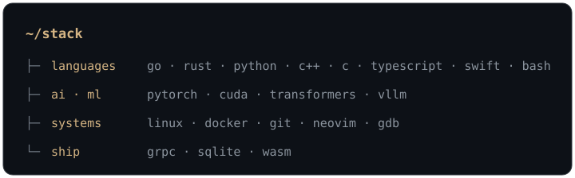
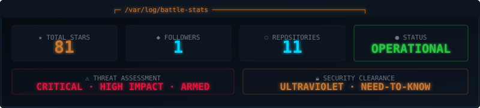

---

## `$ cat manifesto.txt`

> Deep in the stack — between CUDA kernels and the models that run on them.
> I build systems that think, and study the ones that defend.
> Rust where C++ used to bleed. Low-level by choice, high-impact by design.
> Not a title — a habit.

---

## `$ tree stack/`

---

## `$ neofetch`

<picture>
  <source media="(prefers-color-scheme: dark)" srcset="https://raw.githubusercontent.com/Forest-Isle/Forest-Isle/output/github-contribution-grid-snake-dark.svg" />
  <source media="(prefers-color-scheme: light)" srcset="https://raw.githubusercontent.com/Forest-Isle/Forest-Isle/output/github-contribution-grid-snake.svg" />
  
</picture>

---

## `$ ls projects/`

▸ **[ironclaw](https://github.com/Forest-Isle/IronClaw)** &nbsp; `Go`  
▸ **[deepradar](https://github.com/Forest-Isle/DeepRadar)** &nbsp; `Python`

// deeper work lives in private repos

<!-- Add entries here as repos are made public: synapse · AlphaForge · CodeForge · AgentX · TradeMind -->

---

// the quieter you become, the more you are able to hear

